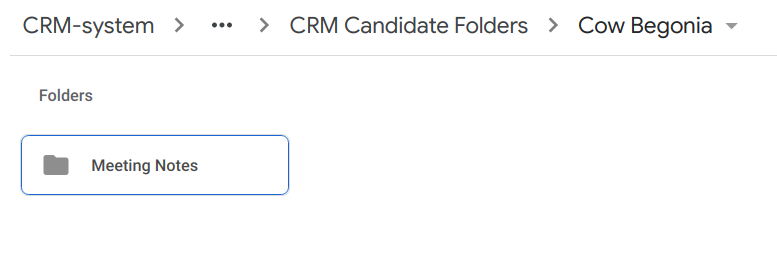
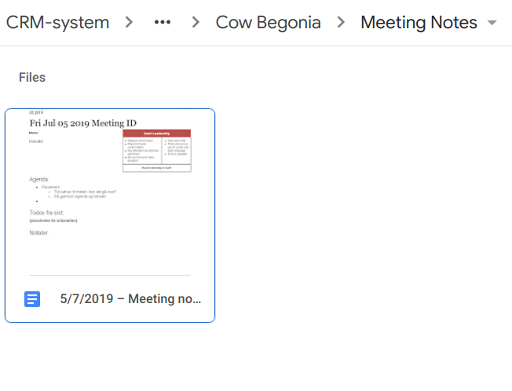
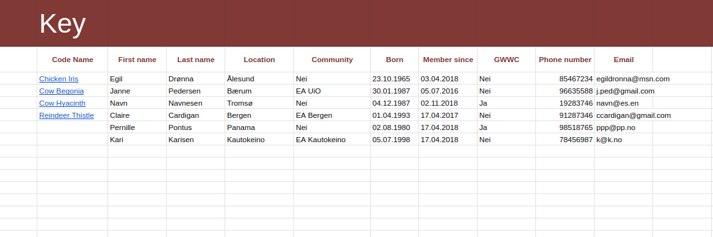
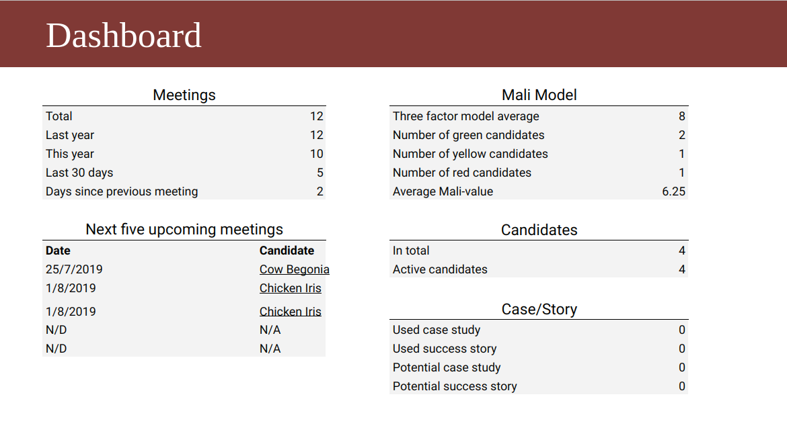
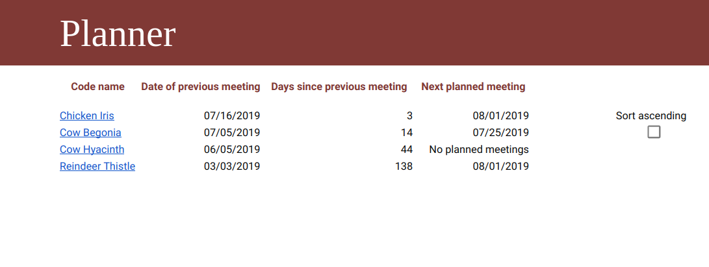
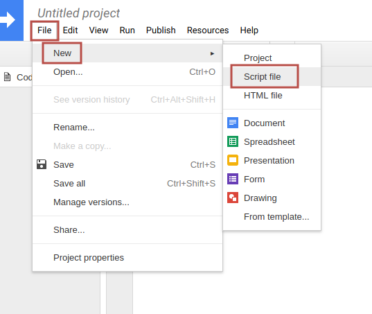
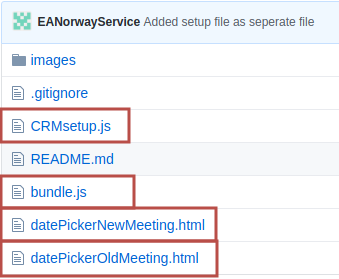
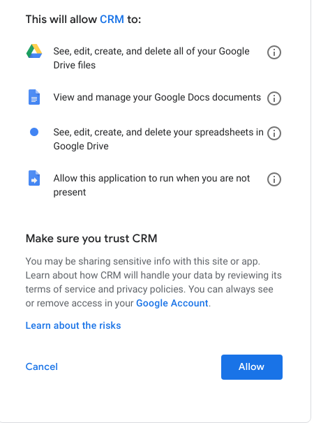
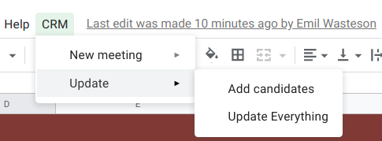

# Table of content
1. [About the CRM system](#aboutCRM)
1. [Set up the CRM system](#setupCRM)
1. [Use the CRM system](#useCRM)
1. [Troubleshoot](#troubleshoot)
1. [FAQ](#FAQ)
1. [Extra](#extra)

# About the CRM system 

This is a Customer Relationship Management (CRM) system run in Google App Script developed by Effective Altruism Norway.
The purpose of this CRM system is to streamline one-on-one meetings for EA groups. Key features of the system:

1. Uses well known spreadsheets and documents in Google Suite.
2. Makes it easy to plan, follow up and evaluate 1:1 meetings for career guiding etc.
3. Makes it easy to adjust and develop to the needs of your group.
4. Lets you see how well you're succeeding at your own set metrics.

### Choose your prefered version
There are currently two versions of this code. One in Google App Script (based on JavaScript) and a more advanced and customizable version in TypeScript. This folder contains the code in Google App Script which makes it easy to copy/paste code directly into Google App Script. See [Setup of CRM](#setupCRM) for tutorial. 

Here is a [link](https://github.com/EANorwayService/CRM_setup_advanced) for the code in TypeScript, use this for easier customizability and local development. Use [clasp](https://github.com/google/clasp/) to upload code to Google App Script. 

### Folder structure
The CRM system consists of two spreadsheets (named "CRM Main" and "CRM Key"), a folder with separate folders for each registrered candidate and a folder with document templates.  
  

Inside the folder "CRM Candidate Folders" there is one folder for each candidate. In this example the candidates have code names.  
  

### Candidate folder
In each candidate folder there is a folder with meeting notes and one may store other documents specific to that candidate. There is a link to the candiate folder in the Metrics sheet and in the Candidate sheets.   
   

### Meetings folder
Notes from all meetings that you have on a candidate are saved in the meetings folder. These notes are created automatically when a new meeting is planned.  
   

### Meeting notes
This is an example of how meeting notes can look. If you want to change the template for meeting notes you can do it after the system has been set up, see insturctions in the [faq](#faq).  
  

### "CRM Key" spreadsheet
The CRM Key is one of two spreadsheets in the CRM system. This spreadsheet contains contact information of candidates and should be stored in a safe place with strict access only for those who need it. At default it consists of only one sheet, but other sheets with sensistive information like sheets linked to forms could also be stored here. EA Norway has two additional sheets here, "Onboarding Form" and "Evaluation Form".  

#### Key sheet
This sheet makes it possible to give candidates code names so that you don't need to use their actual name throughout the system to protect their identity. However, if you don’t want to use code names, you can use their actual names in the code name column.  
  

#### Evaluation Form 
This sheet is specific for EA Norway and contains the answers from the meeting evaluation form.  
The evalutation form is not added by defailt, but you can add it by following the instructions [here](#extra).  

#### Onboarding Form 
This sheet is specific for EA Norway and contains the answers from an onboarding form.  
The evalutation form is not added by defailt, but you can add it by following the instructions [here](#extra).  

### CRM Main spreadsheet
The CRM Main spreadsheet is the second, and most central spredsheet of the system. This will be the sheet you are using most often and it provides you with an overview of results from your 1:1 meetings. With some basic understanding of spreadsheets you can add your own metrics to track.  

#### Dashboard
This is the first sheet of the CRM Main spreadsheet and provides you with an aggregated data for all active candidates. Information in the spreadsheet is updated automatically here when changed in the candidate sheets. This sheet is meant to be read only.  
  

#### Metrics
This sheet contains information on all candidates, one person per row. By using filters it is possible to select a subset to look for specific information of eye ball a distribution. Information is added and updated automatically in this sheet. This sheet is meant to be read only.  
  

#### Planner
This sheet shows an overview of previous meeting and planned meeting of each candidate. The information is fetched form the candidate sheets and this sheet is meant to be read only.  
  

#### Candidate sheets
Each candidate has their own candidate sheet, and a new sheet is created each time a new candidate is added. This is an example for a candidate sheet for a candidate with the code name "Chicken Iris". These sheets are automatically created when a candidate is added.  
  

#### Dashboard Historical Data (_hidden in spreadsheet_)
This sheet stores historical data from the Dashboard sheet, by adding a snapshot of all information from the Dashboard sheet once a week. Only used for calculation purposes and should not be edited it you are very sure of what you are doing.  
  

#### Meetings Historical Data (_hidden in spreadsheet_)
This sheet saves information from all planned meetings, updates automatically when a meeting is added. Only used for calculation purposes and should not be edited it you are very sure of what you are doing.  
  

#### Metrics Historical Data (_hidden in spreadsheet_)
This sheet saves historical information on all candidates. By automatically adding a snapshot of all information from each candidate sheet once a week. Only used for calculation purposes and should not be edited it you are very sure of what you are doing.  
  

# CRM system Setup 

### Required for CRM system setup
1. A Google account
2. Access to the Google Drive Folder where you want to place your CRM system.  
3. A list of names with (optional) contact info you want to import to your CRM system. We will call this "the member list" in this guide. You can also start without any initial candidates and add individuals later.  

### Alternative 1: Local development
If you don't want to edit the code, or you are not familiar with using the terminal use alternative 2 instead. Choose this alternative if you would like to add features, or for other reasons tweek the code. To download a fork of the code in GitHub use [git](https://git-scm.com/book/en/v2/Getting-Started-Installing-Git). Afterwards you should use [clasp](https://github.com/google/clasp/) to upload code to Google App Script. Clasp also makes it possible to write code in typescript. You have to enable API [here](https://script.google.com/home/usersettings) before you can use clasp.  

### Alternative 2: Copy/paste code to Google App Script
If you haven't used a terminal before the easiest way to transfer the code to Google App Script is to copy/paste the code from GitHub to Google App Script.  

#### Create a new project on script.google.com
Log in with your preferred Google account and go to .  
Create a new project by clicking "New script", and give the new project a descriptive name; for instance "CRMsystem" (name of file should _not_ contain spaces).  
  

Open the project and make an additional script inside the project, you should now have two scripts. Name these scripts "bundle" and "CRMsetup". They will automatically get the file ending ".gs".  
  

Make two additional HTML files and name them "datePickerNewMeeting" and "datePickerOldMeeting". They will automatically get the file ending ".html".  
  

You should now have two scripts(.gs) and two html files(.html) like this listed on the left side:  
  

Clear the files by marking and delete all default code from all four files.  
  
  

#### Copy code from GitHub and paste on Google App Script
Open the following files from [GitHub](https://github.com/EANorgeService/CRMsetup): bundle.js, CRMsetup.js, datePickerNewMeeting.html and datePickerOldMeeting.html, mark and copy all code from them and paste in each corresponding file you just created in Google App Script. Save both scripts and both html files.  
  

### Setup
After copying and pasting all code from GitHub to Google App Script the CRM-system can be set up in a destination folder on your Google Drive.

### Step 1: Enable Advanced Drive Service
Do the following in the project you just made in . Click **Resources > Advanced Google Services** scroll down to **Drive API** and enable it.  

### Step 2: Add file ID with list of initial candidates to CRMsetup.gs
Find or make a Google spreadsheet with a list of the names of the people you want to import to your CRM system. You can use a wider list of people and later choose who you specifically want to add as candidates to the system.  
See [this example](https://docs.google.com/spreadsheets/d/1PEZhv7JwFeFfu8oeloPuxFmHMNCop2YdguYI1G0g4io/edit?usp=sharing) of such a list, and use the example list if you are only testing the system. Your list should have the same structure as the example linked above. The script assumes that your list starts in cell A1. Now copy the ID between the last two backslashes in the URL of your list, as shown below. Do not include the backslashes.  

Go to the script called CRMsetup, and add the ID to **MEMBERLIST_ID**, add the ID between quotationmarks. The script will copy all information from your list and add it to the key sheet. br/>

Remember to not delete or overwrite the qoutationmakrs and save the script.  

### Step 3: Add ID for destination folder to CRMsetup.gs
Choose a secure location on Google Drive with the sharing settings of your liking (but your Google account must have full access). This will be the location of your CRM-system. Find the ID of that Google Drive folder. Copy this ID, do not include the backslashes.  
  

Go to the script called setUpCRM.gs, and add the ID to **DRIVE_FOLDER_ID**, add the ID between quotationmarks.  
  

Remember to not delete or overwrite the qoutationmakrs and save the script.  

### Step 4: Try to run setupCRM() function
Be sure all scripts are saved. When you've added ID for destination folder and for list of initial candidates make sure you are in the setUpCRM.gs file and click **Run > Run function > setUpCRM**.  
  

NB: You may be asked to review [authorization](https://developers.google.com/apps-script/guides/services/advanced), see picture below.  
  

If you can not find the function setupCRM() you might be in the wrong file. The CRM system is not a published app nor is it verified by google, therefore google needs permission to run the app. More information [here](https://developers.google.com/apps-script/guides/services/advanced). Click review permission and allow.  
  

Now Google will tell you that the CRM system is not an app verified by them. Click **Advanced > Go to CRM(unsafe)**  
  

### Step 5: Run setUpCRM() function again
After reviewing permission and allowing the CRM system access and approving that you know and trust the app/developer you need to run the setUpCRM function once more.  

Make sure you are in the setUpCRM.gs file and click **Run > Run function > setUpCRM**. If you can not find the function **setupCRM()** you might be in the wrong file.  
  

If there are multiple crm-versions in the destination folder, you should remove all older versions and only run the newest one.   

### Step 6: Move CRM Key spreadsheet to a secure location
If you prefer to used anonymised code names and you don't want everyone using the CRM system to have access to candidates real name you can move the Key spreadsheet to some other location. Only accounts given access to this sheet may run the function "add candidates". Remember that everyone who has access to the script files can also access data from the Key spreadsheet. 

# Using the CRM system 

### Add candidates
Start in the Key spreadsheet. You may use code names for the candidates, instead of their real names, to mask their identity. A good tool for generating random code names is www.codenamegenerator.com. If you don't want to use code names, you can use the candidates' real names in the code name-column of the Key sheet.  

After you have added code names click **CRM > Add candidates** in the Google Sheet Menu. Only candidates with text in the code names column will be added to the system. The script assumes values in column B(from cell B3) are code names. If you want to use candidates' real names add their  names to column B instead of code names.  
  

In the example above Pernille and Kari would not be added as candidates since nothing is written in the Code Name column (no value in column B). After you have added code names click **CRM > Add candidates**. Only members/candidates with code names will be added to the system.  
  

When candidates are added, each one will have their own subfolder in the folder "CRM Candidate Folders". They also get their own sheet in the CRM Main spreadsheet, and their information is linked in the Metrics overview sheet. The names of the candidate folders and candidate sheets can only be changed if the code name is changed everywhere at once (inlcuding the hidden Metrics Historical Data sheet and the hidden Meetings Historical Data sheet).  

### Add metrics for candidates 
These are the metrics EA Norway use and they are added to each candidate sheet. See this [guide](https://github.com/EANorwayService/CRM_setup_advanced#aboutCode) if you want to change the metrics.  
  

The Metrics with white background can be set here, but those with grey background are read only and should not be altered directly.  

### Plan meetings and create meeting notes
Go to the candidate sheet of the candidate you plan to meet.  
  

If you choose "Plan new meeting", meeting notes are created automatically from the meeting notes template and added to the candidate's folder. If you want to add a meeting you allready had, choose "Add previous meeting" instead. Provide the date of your meeting and url to your meeting notes.  

To replace the meeting notes template see instructions in the [faq](#faq). Information about meetings will be added to the hidden sheet "Meetings Historical Data" for certain background handling.  

### Add actionables to meeting notes
If your meeting notes have a table, the code will assume that the last table is a list of actionables and will be added to the candidate's folder. This is how it looks in exisitng template:  
  
Actionables from previous meetings will be added to the candidate sheet as well as the notes of the upcoming meeting (added on the day of the upcoming meeting).  

### Set candidates as active/inactive
To set a candidate as inactive simply change the variable in the candidate sheet.  
  

Change status of candidate  
  

When the system is updated after a candidate is set as "inactive" their sheet will be hidden. When a candidate is inactive their information will not be counted in Dashboard, but for the number of meetings held, which are still counted.  
To set a candidate back to active you can unhide the sheet and switch back to active. If you only unhide the sheet, it will be hidden again when system updates. 

### Update system
Updating the system after adding, removing og changing data in it is unfortunately not done automatically, but for once every night at 5am. The "Update Everything" function wil check for new inactive candidates, fills the next five meetings in the dashboard, fills previous meeting and upcoming meeting in candidates sheet and check for new candiates to add.  
  

# Troubleshoot 

### No items with the given ID could be found
  
This error means that one of the id's are wrong. It is probably the ID for the destination folder that is missing.  

### Invalid argument: parent
  
This means that an ID for a folder is the ID for something else than a folder. Check again that the ID for the destination folder is correct.  

### Access denied DriveApp
  
This means that you don't have access to, or that the ID to a file is wrong. Check again that the Id for the member list is correct and that you have access to all template files.  

### We're sorry a server error occurred
  
This probably means that an ID for a file is missing, check again that you added the ID for the member list.  

### If it is not the member list ID and not the destination folder ID:
1. Double check that you use the correct Google account when *editing* the scripts, it says what account you use in the top right corner.
2. The code was not copied correctly from GitHub.
3. There is a mistake in the template folder :( Contact EA Norway (post@effektivaltruisme.no)
4. There is a mistake in the code :( Contact EA Norway (post@effektivaltruisme.no)

# FAQ 

### What do I need to know to use alternative 1 of set up?
Alternative 1 is not difficult, but it takes longer if you have never used a terminal before and probably requieres some googleing. If you are going to use this system, alternative 1 is recomended, it makes it easier to make your own changes later. Here is a [guide](https://github.com/EANorwayService/CRM_setup_advanced) for alternative 1.  

### How to change meeting notes template
If you replace the whole file you also need to update the file id in the code, if you only replace the content of the existing file you do not have to change anything in the code. The meeting notes template can be changed by going to your CRM folder and click:  
**CRM Templates > CRM Template Meeting Notes**.  
If you want to replace the file, and not just the content of the existing file, open the code editor with you CRM code. Click **File > Project properties > Script properties** and change the value of MEETING_NOTES_TEMPLATE_ID to the ID of your meeting notes file. This file can by save anywhere but the person running the "add meeting" function needs to have link access to it.  

### Can I change the names of spreadsheets or sheets?
The names of the _spreadsheets_ can be changed. But unfortunately the names of the _sheets_ within the spreadsheets *can not be changed* without also changing them in the code. Also, the folders with the code names of each candidate *can not be changed*.  

### Can I remove, add or change something in sheets?
The code does not know what your sheets look like if you make changes. If you change the structure of sheet you probably also need to change this in the code if it is a part that is affected by the code. Here is a guide on how to do it: https://github.com/EANorwayService/CRM_setup_advanced#aboutCode.  

### Can I change the names of the folders? 
You can change the names of all folders *except the candidate folders*, they need to have the same names as the candidates. The folders with the meeting notes inside the candidate folders also need to have the original name, if no folder with the name "Meeting Notes" is found in candidate folder a new folder with the name "Meeting Notes" will be created when a new note is generated.

### Can I change the name of a candidate?
Yes, but then you need to change the name in all of the following as well:
1. Metrics
2. Metrics Historical Data
3. Meetings Hisorical Data
4. the name of the candidate sheet
5. the name of the candidate folder
You do not have to change anything in the code.  

### Can I delete/remove a candidate?  
Yes but then you need to delete the candidate from all of the following: 
1. Metrics (delete the candidate's row)
2. Metrics Historical Data (delete all rows with the candidate, if you want to delete all data)
3. Meetings Hisorical Data (delete all meetings if you want to delete all data)
4. the candidate's sheet
5. the candidate's folder
You do not have to change anything in the code.  
After doing this you should run the function copySystem(). This function will make a function of all spreadsheets and add the new sheets to the code. This way the candidate is also deleted from the spreadsheets' version history.  

### How can I change when and how often the system is updated autmatically?
Open the code and click *Edit > Current project's triggers*. Find the trigger for updateEverything() and you can now edit how often this is triggered.  

### How can I change how often dashboard and candidates are snapshoted for the historical sheets? 
Open the code and click *Edit > Current project's triggers*. Find the trigger for weeklySnapshot() and you can now edit how often this is triggered.  

### What is case study/success story?
The CRM system allows you to mark candidates as potential case studies or success stories. You can use case studies/success stories for reporting, testemonials or qualitative evaluation of your 1:1 conversations, for instence.  

### What is the three-factor model? 
This is a model introduced by the Centre for Effective Altruism to get an overview of the candidates' levels of resources, dedication and realisation. You give a score for each candidate from 1-3 on these three factors, and can see aggregated and average scores in the Dashboard and Metrics tabs in the CRM Main. Send an email to post@effektivaltruisme.no for more information.  

### Who should I contact if I have issues? 
post@effektivaltruisme.no  

# Extra 

### Add a form to the CRM system
EA Norway has an onboarding Google form that new candidates fill out before the first one-on-one, and an evaluation Google form that they fill out after each one-on-one that they have. It is possible to add such forms into the system, and get the answers from the forms in each candidate sheet  

The CRM-system already has functions specific for these forms and the functions can be fitted to other forms. Adding these forms are optional, and you can add any type of Google Form that you would like to get the answers from.  

#### Add Onboarding Form 
1. Search for handleFillOnboardingForm() in the code file; and find the one with two slashes in front.  
    Before:  
      
    After backslashes have been removed:  
      
1. Change name of sheet  
      

#### Add Evaluation Form 
1. Search for handleFillEvaluationAnswers() in the code file; and find the one with two slashes in front. 
    Before: 
     
    After backslashes have been removed: 
     
1. Change name of sheet 
    

