# Table of content
1. [About CRM](#aboutCRM)
1. [Set up the CRM system](#setupCRM)
1. [Use CRM system](#useCRM)
1. [Troubleshoot](#troubleshoot)
1. [FAQ](#FAQ)
1. [Extra](#extra)

# CRM 

This is a CRM system in Google App Script developed by Effective Altruism Norway.
The goal of this CRM system is to streamline 1-1 meetings. Key features of the system:

1. Uses spreadsheets and documents in Google Suite.
1. Makes it easy to plan 1:1 meetings for career guiding etc.
1. Makes it easy to adjust to your own needs.
1. Let's you see how well you're succeeding at your metrics.

### Versions
There are currently two versions of this code. One in Google App Script and one in TypeScript. This folder contains the code in App Script which makes it easy to copy/paste code directly into Google App Script. See [Setup of CRM](#setupCRM) for tutorial. 

Here is a [link](https://github.com/EANorgeService/CRMsetup) for the code in TypeScript, use this for local development and use [clasp](https://github.com/google/clasp/) to upload code to Google App Script. 

### Folder structure
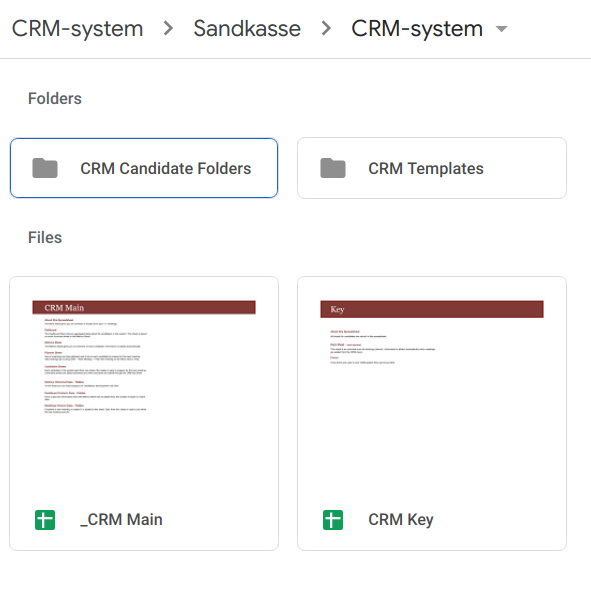

### Key spreadsheet
You can choose if you want to use real names for candidates or code names. The Keys spreadsheet copies all information from a list of members. 

### CRM Main spreadsheet
The _CRM Main spreadsheet gives you an overview of results from your 1:1 meetings.
With some basic understanding of spreadsheets you can add your own measurements of success.

#### Dashboard

#### Metrics
The Metrics Sheet gives you an overview of each candidate.

#### Planner
See all meetings you have planned, and click on each candidate to prepare for the next meeting.

#### Candidate sheets
Example of the candidate sheet:

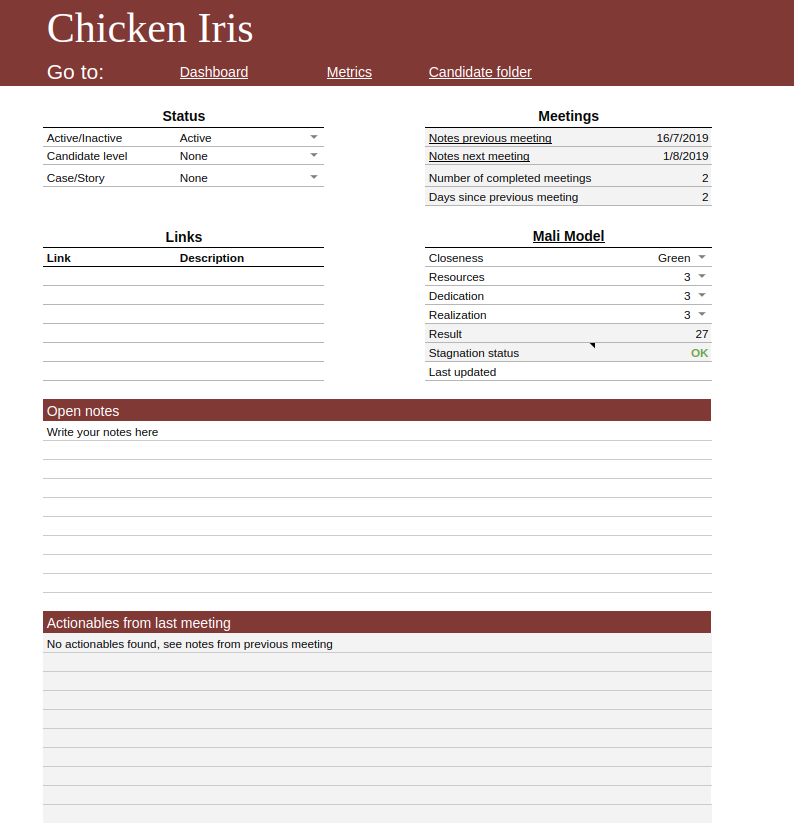

#### Dashboard historical Data
Sheet that could be useful for gathering data. Can be used when calculating measurements of success.

#### Meetings Historical Data
Overview over all meetings you've had.

#### Metrics Historical Data

### Candidate folder

### Meetings folder
Notes for all meetings are saved in the meetings folder for each candidate.

### Meeting notes
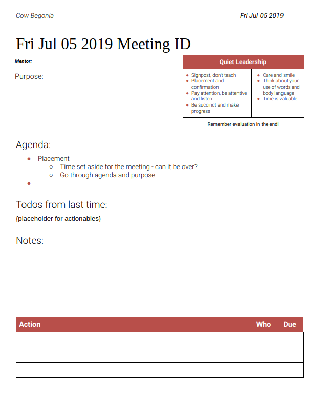

# Set up the CRM system 

### Needed to set up CRM system
1. Access to CRMsetup [folder](https://github.com/EANorgeService/CRMsetup) in GitHub.
1. Access to CRMtemplates [folder](https://drive.google.com/drive/folders/1fcHDHTCHAwwFkLSWX1SwQ-gZExy5NBI5?usp=sharing) in Google Drive.
1. Access to the Google Drive Folder where you want your CRM system.
1. Access to a list of all your members, or another list including the people you want as candidates in you system. You can later choose who you want to include from the given list. From now on this list will be called the member list.

### Alternative 1: Local development
If you don't want to change the code, or your not used to the terminal skip to the next section.
Do this if you want to change the code or you know the basics of using a terminal, else the easiest way is to copy/paste.
To download the code for GitHub use [git](https://git-scm.com/book/en/v2/Getting-Started-Installing-Git).
Use [clasp](https://github.com/google/clasp/) to uploade code to Google App Script. Clasp also makes it possible to write code in typescript. You have to enable API [here](https://script.google.com/home/usersettings) before you can use clasp.

### Alternative 2: Copy/paste code to Google App Script
If you haven't used a terminal before the easiest way to transfer the code to Google App Script is to copy/paste the code from GitHub to Google App Script.

#### Create a new project on script.google.com
Log in with the correct account to google and go to Google App Script: script.google.com.
Make a new project by clicking "New Script", and give the new project a descriptive name for instance CRMsystem (name of file should not have spaces).

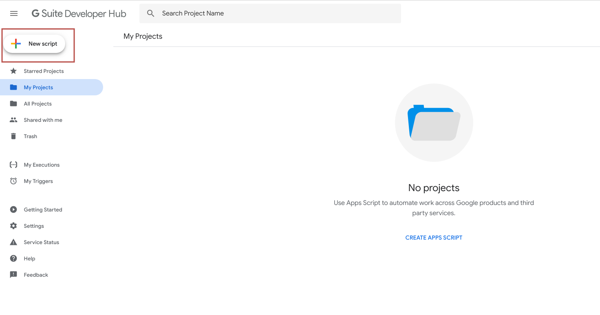

Open the project and make one additional script inside the project, you should now have two scripts. Gives these the names bundle and CRMsetup. They will automatically get the ending ".gs".

Make two additional HTML files and give these files the same names datePickerNewMeeting and datePickerOldMeeting. They will automatically get the ending.html. 

You should now have two scripts(.gs) and two html files(.html):

Delete all default code from both script and both html files.

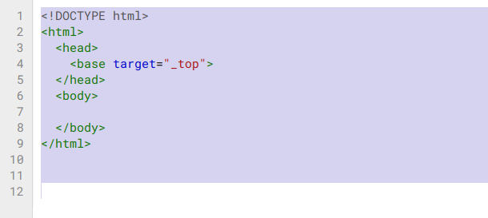

#### Copy code from GitHub
Open these files on [GitHub](https://github.com/EANorgeService/CRMsetup): bundle.js, CRMsetup.js, datePickerNewMeeting.html and datePickerOldMeeting.html, copy all code from them and paste code to the two different scripts and two different html files you just made in Google App Script.

#### Paste all code to the Google App Script edito
Be sure to paste code from GitHub in to two different scripts and two different html files, check that you got all code.

Save both scripts and both html files.

### Setup
After copying and pasting all code from GitHub to Google App Script the CRM-system can be set up in a destination folder on your google drive.

### Step 1: Enable Advanced Drive Service
Open the project you just made on [script.google.com] click **Resources > Advanced Google Services** scroll down to **Drive** and enable it. 
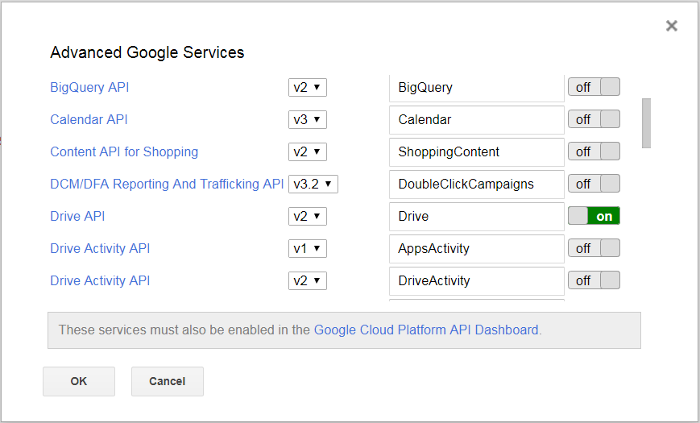

### Step 2: Add ID for file with list of members to CRMsetup.gs
Find or make a google spreadsheet with a list of your community members. You can later choose from this list who you want to add as candidates to the system. Be careful to not include the last part of this URL.  
[This is an example](https://docs.google.com/spreadsheets/d/1PEZhv7JwFeFfu8oeloPuxFmHMNCop2YdguYI1G0g4io/edit?usp=sharing) of such a list, if your only trying the system you can use this list as you member list. See this example for how your memberlist should be strucutred. The script assumes that you memeber list starts in cell A1. See more information on the key sheet here: [About CRM](#aboutCRM). 

The script will copy all information in the memberlist and add it to the key sheet. 
Find the ID of the list, do not include the backslashes. 

Go to the script called CRMsetup, and add the ID to **MEMBERLIST_ID**, add the ID between quotationmarks.

Remember to save the script and not delete the quotationmarks.

### Step 3: Add ID for destination folder to CRMsetup.gs
The CRM system should be set up in a secure location and has to be in a Google Drive folder you have access to. Decide where you want the CRM-system to be set up, and find the ID of that Google Drive folder. Copy this ID, do not include the backslashes.

Go to the script called setUpCRM.gs, and add the ID to **DRIVE_FOLDER_ID**, add the ID between quotationmarks, do not delete the quotationmarks.

Remember to save the script and do not delete the quotationmarks.

### Step 4: Try to run setupCRM() function
Be sure all scripts are saved.
When you've added ID for destination folder and for list of members make sure you are in the setUpCRM.gs file and click **Run > Run function > setUpCRM**
NB: you need to review [authorization](https://developers.google.com/apps-script/guides/services/advanced), see picture below.
If you can not find the function setupCRM() you might be in the wrong file.
The CRM system is not a published app nor is it verified by google, therefore google needs permission to run the app. More information [here](https://developers.google.com/apps-script/guides/services/advanced).

This might pop up:

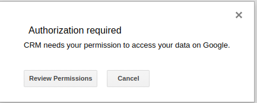

Click review permission and allow.

Now google will tell you that the CRM system is not an app verified by them

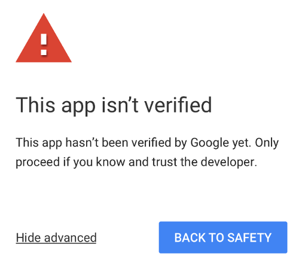

Click **Advanced > Go to CRM(unsafe)**

### Step 5: Run setUpCRM() function again
After reviewing permission and allowing the CRM system access and approving that you know and trust the app/developer you need to run the setUpCRM function again.

Make sure you are in the setUpCRM.gs file and click **Run > Run function > setUpCRM**.
If you can not find the function **setupCRM()** you might be in the wrong file.

If there are multiple crm-versions in the destination folder now be sure to keep the newest one and remove all other version, the code will not work on these. 

# Use the CRM system 

### Add candidates
Open your destination folder, the folder with the crm system, and go to the Key spreadsheet. It is possible to set up the system with codenames of candidates, instead of their real names. A good tool for finding codenames is www.codenamegenerator.com. If you do not wish to use codenames, you can use the candidates' real names in the codename-column of the Key sheet.
After you have added code names click **CRM > Update candidates**. Only members/candidates with codenames will be added to the system. Script assumes values in column B(from cell B3) are code names. If you wish to set up the system with candidates real names add their real names to column B. 

In this example Pernille and Kari would not be added as candidates since they don't have a code name(no value in column B).
After you have added code names click **CRM > Add candidates**. Only members/candidates with code names will be added to the system.

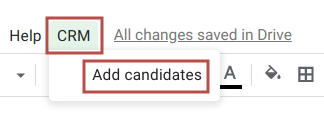

When candidates are added they get their own folder in the folder "CRM Candidate Folders". They also get their own sheet in the _CRM Main spreadsheet, and their information is linked in the Metrics sheet. The names of the candidate folders and candidate sheets can only be changed if the code name is changed everywhere(inlcuding the Metrics Historical Data sheet and the Meetings Historical Data sheet).

### Add metrics for candidates 
These are the metrics EA Norway use and they are added to each candidate sheet. See the [guide for the code](https://github.com/EANorwayService/CRM_setup_advanced#aboutCode) if you want to change the metrics. 
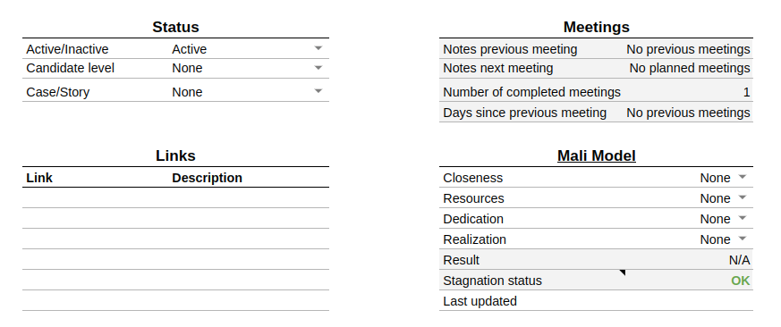
Metrics with white background should be changed in the candidate sheets. Metrics with grey background are added automatically. 

### Plan meetings and create meeting notes
Go to the candidate sheet of the candidate you want to plan a meeting with. 

If you already have existing meeting notes choose "Add old meeting". Add the date and url to your existing meeting notes.  
If you choose "plan new meeting" meeting notes are created automatically from the meeting notes template and added to the candidate folder. 
To replace the meeting notes template see instructions in the [faq](#faq). Information about meeting will be added to the hidden sheet "Meetings Historical Data".
### Add actionables to meeting notes
If your meeting notes have a table code will assume that the last table in notes is actionables. This is how it looks in exisitng template: 

Actionables from previous meeting will be added to the candidate sheet and to the notes of the upcoming meeting (added on the day of the upcoming meeting). 

### Set candidates as active/inactive
To set a candidate as inactive change the variable in the candidate sheet.  
  
Cange status of candidate  
  
When system is now updates the sheet of the candidate will be hidden. When a candidate is inactive their information will not be counted in dashboard, only their meetings are still counted. 
To set a candidate back to active unhide the sheet and set the candidate back to active. If you only unhide the sheet the sheet will be hidden again when system updates. 

### Update system

# Troubleshoot 

### No items with the given ID could be found

This error means that one of the id's are wrong. It is probably the ID for the destination folder that is missing.

### Invalid argument: parent

This means that an ID for a folder is the ID for something else than a folder. Check again that the ID for the destination folder is correct.

### Access denied DriveApp

This means that you don't have access to, or that the ID to a file is wrong. Check again that the Id for the member list is correct and that you have access to all template files.

### We're sorry a server error occurred

This probably means that an ID for a file is missing, check again that you added the ID for the member list.

### It is not the member list ID and not the destination folder ID!
1. Double check that you use the correct google account when *editing* the scripts, it says what account you use in the top right corner.
1. The code was not copied correctly from GitHub.
1. There is a mistake in the template folder :( Contact EA Norway
1. There is a mistake in the code :( Contact EA Norway

# FAQ 

### How to change meeting notes template
If you replace the whole file you also need to update the file id in the code, if you only replace the content of the existing file you do not have to change anything in the code.
The meeting notes template can be changed by going to your crm folder and click  
**CRM Templates > CRM Template Meeting Notes**.  

### What do I need to know to edit the code?
Changes to the code can be written in either [Javascript](https://github.com/EANorgeService/CRMsetup) or [Typescript](https://github.com/EANorgeService/CRM) and basic knowledge in one of these languages is necessary.

### Can I change the names of spreadsheets or sheets?
The names of the spreadsheets *can be changed*. Unfortunately the names of the sheets within the spreadsheets *can not be changed* without also changing them in the code. Also the folders with the code names of each candidate *can not be changed*.

### Sort code names in alphabetical order
To sort the code names list alphabetically select the column with the code names(or another column you wish to sort) and click **data -> sort selection**.
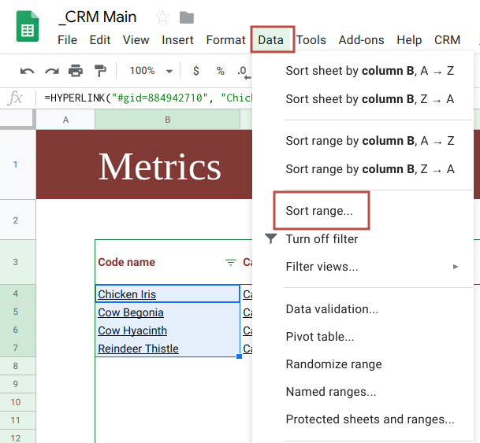

# Extra 

### Add a form to the CRM system
EA Norway has one form candidates fill out before the first conversation and one form each candidate fills out after each conversation.
The CRM-system already has functions specific for these forms and the functions can be fitted to other forms. 

#### Add Onboarding Form 
1. Search for handleFillOnboardingForm(); and find the one with two slashes in front. 
    Before: 
     
    After backslashes have been removed: 
     
1. Change name of sheet 
    

#### Add Evaluation Form 
1. Search for handleFillOnboardingForm(); and find the one with two slashes in front. 
    Before: 
     
    After backslashes have been removed: 
     
1. Change name of sheet 
    

